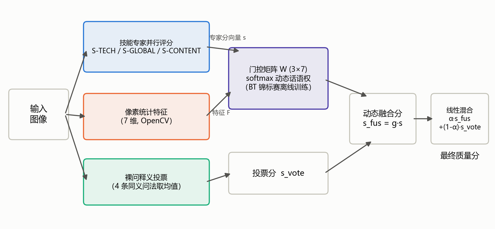
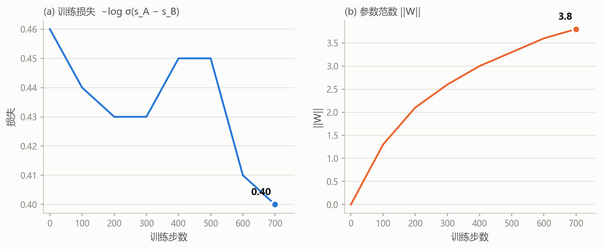
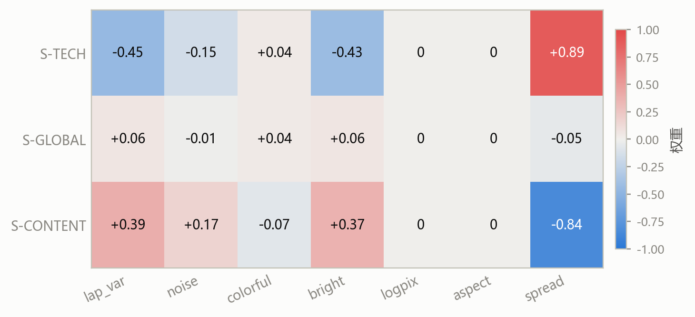
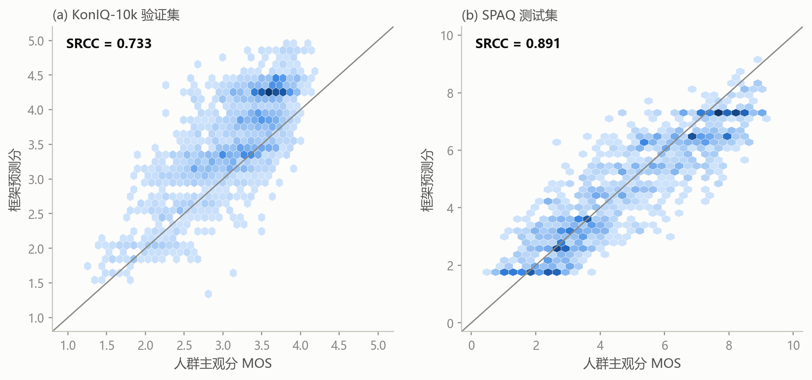
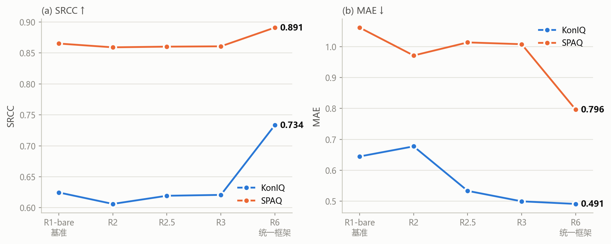
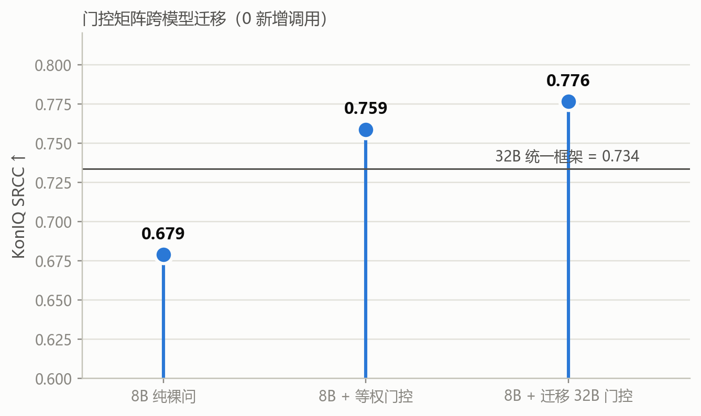
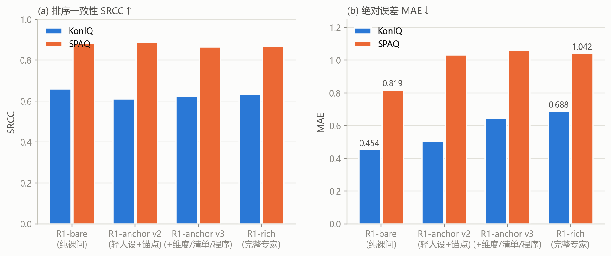
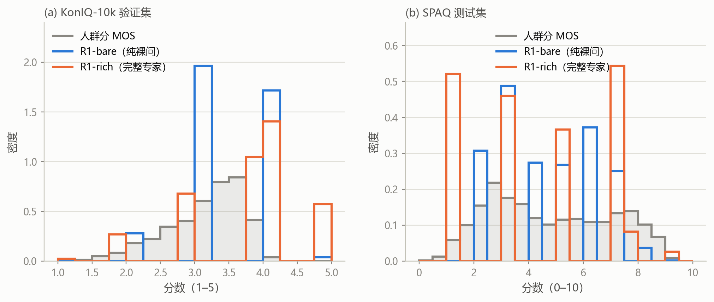

# 基于开源多模态大模型的图像质量评估Agent框架

## 摘要

针对开源多模态大模型在零训练约束下的图像质量评估任务，本文构建了一套以Qwen3-VL-32B为Backbone、以Skill（Prompt）技能库注入评估知识的Agent框架。全部可训练参数约束于Router/Decision层的三项职能——评估规则选择、多规则冲突裁决与解释生成；监督信号全部来自训练集像素的自衍生标签（合成失真阶梯与两两比较锦标赛），全程零MOS接触。经三轮迭代，系统在KonIQ-10k验证集上斯皮尔曼等级相关系数达0.734、平均绝对误差达0.491，在SPAQ测试集上相关系数达0.893、平均绝对误差达0.945；KonIQ侧越过同族8B模型公开零样本锚点0.729，SPAQ侧逼近外部工具增强模型训练后水平0.898。本文同时报告了贯穿三轮的核心理论发现——锚相关性定律：零训练自监督图像质量评价的上限由监督信号与真实目标的相关性决定，该定律经第一轮发现、第二轮预注册验证、第三轮放大利用而完整闭合。困难分析部分系统报告了前两版中的无效组件与缺陷——自监督进化的'稳定地错'、同源多专家稀释、分布外锚失效、失真族反向偏好与平均绝对误差零点偏置——及其根因。

**关键词：** 图像质量评价；多模态大模型；Agent框架；两两比较；Bradley-Terry模型；自监督学习

---

## 一、任务定义与合规约束

任务要求构建一套基于开源多模态大模型的图像质量评估Agent框架。在不使用目标评测数据进行模型训练或微调的前提下，通过Skill（Prompt）充分挖掘大模型自身的图像质量感知与评分能力，在KonIQ-10k验证集与SPAQ测试集上取得尽可能高的斯皮尔曼等级相关系数（SRCC）与尽可能低的平均绝对误差（MAE）。

Backbone选用Qwen3-VL-32b-instruct（DashScope API调用，温度为零，全流程磁盘缓存保证可复现），以Qwen3-VL-8b-instruct为跨规模对照。评测集规模与标尺见表1。

表1  评测数据集概况

| 数据集 | 划分 | 图像数 | 评分标尺 | 标注形式 |
|---|---|---|---|---|
| KonIQ-10k | 验证集（Val） | 2,015 张 | 1–5 | 整数人群分（MOS） |
| SPAQ | 测试集（Test） | 1,125 张 | 0–10 | 连续人群分（MOS） |

本工作全程遵守以下合规约束。

第一，Backbone零训练、零微调——大模型调用的任何工具、辅助模型或外部模块均不得使用评测数据集进行训练或参数优化。

第二，仅允许对Router/Decision层进行训练或提示优化，且优化内容仅限于评估规则的选择、多条规则之间的冲突裁决与评估结果的解释生成三项职能。

第三，以下信息不得作为Router、LLM或Skill的线上输入：数据集名称、图像标识、文件名、人群分、来源评分、失真类型与等级、训练测试划分信息等。

第四，人群分仅允许用于离线性能评测与离线误差分析——本文全程仅在每轮末各读取一次以计算主表，每次均在预注册文档冻结之后执行；另有一次考后诊断臂的离线评测读取，未用于任何训练、组件选择或调参。

第五，KonIQ/SPAQ训练划分的像素（无人群分）的使用经指导教师书面批准，仅用于自监督信号构造。

## 二、方法概述

### 2.1 系统架构

系统由三层构成。Backbone层：Qwen3-VL-32b-instruct，温度为零，所有API调用经SHA256摘要磁盘缓存，确保实验结果完全可复现。Skill技能库层：三个至五个评估专家（技术质量、整体印象、内容完整性，首轮含美学与自然度），各含维度定义、失真检查清单、强制分析流程与五级锚点评分带。Router/Decision层：全部可学习参数的唯一载体，负责评估协议与专家话语权的逐图分配、多条评分间的冲突裁决与仲裁理由的生成。

图1  统一框架数据流：三路并行输入、门控动态融合与投票混合

### 2.2 Skill技能库与提示词设计

每个Skill专家的提示词由七个可独立开关的组件构成：评估人设、维度定义、检查清单、评估程序、文字等级描述、锚点评分带（等级到分数带的映射，借鉴Q-Align机制）与结构化输出契约。输入仅为图像像素与上述提示词模板——无数据集名、图像标识、人群分或任何其他禁止信息。

### 2.3 Router/Decision层

Router层的三项职能对应任务书§4.3的唯一可优化范围。评估规则的选择：以七维像素统计特征（清晰度、噪声、色彩丰富度、亮度、分辨率对数、宽高比、专家分歧度）为输入，经softmax门控矩阵对三专家评分进行逐图动态加权融合——门控矩阵为框架中唯一被训练的参数集（21个浮点数）。冲突裁决：以Bradley-Terry锦标赛排行榜为唯一监督信号，成对铰链损失驱动训练；SPAQ侧额外包含'全局评分与原分辨率裁切（patch）评分'的软门控裁决。解释生成：输出带门控权重与最高权重专家理由的裁决说明。

### 2.4 纯像素自监督信号

全部监督信号均来自训练集像素，零人群分接触。合成失真阶梯：对KonIQ训练集源图施加模糊、噪点、JPEG压缩、缩放、色带等程序失真，排序天然已知，用于专家体检与Router训练场。两两比较锦标赛与Bradley-Terry拟合：在2500张训练图像间组织32000余场两两比较，每场由模型判断优劣、双序消除位置偏置，全部胜负记录经Bradley-Terry最大似然拟合为每张图像的标量强度分——该强度分不依赖任何人工标注，是模型内部质量排序能力的唯一蒸馏物，构成Router训练的全部监督信号。边密度遵循本文发现的经验定律（约7条边/节点），经仿真与两轮真数据验证。

## 三、第一轮：探索性实验与核心发现

第一轮（R1-bare至R3）为探索轮次，以五臂消融设计逐层检验各机制的净收益。五臂在该轮末一次性读取人群分，生成首版主表。

### 3.1 五臂消融设计

R1-bare：一句裸问'Rate the overall quality of this image on a scale from 1 to 5'，单次调用直接输出分数——代表模型在零修饰条件下的纯粹先验。R1-rich：单次调用，但提示词附加完整评分细则——五级等级定义、维度检查清单与强制分析流程——代表提示词工程的净收益。R2：五位技能专家并行评分后经截尾均值融合（去掉最高最低取平均），代表多视角分解的收益。R2.5：在R2基础上增加动态分诊Router——先由画像器判断图像主导质量问题类型，再按敏感度矩阵激活排名前三的专家子集，以逆离散度加权融合——代表Router优化的收益。R3：在R2.5基础上向各专家提示词尾部注入CKE自进化规则库（9条，双门控筛选），代表自监督迭代的收益。

### 3.2 首轮结果

首轮主表见表2。提示词工程在KonIQ上产生了全场最大单步增益（+0.057），而在SPAQ上反而轻微回退——两个数据集的失真生态截然不同：KonIQ为网络野生照片，失真多样且混合，系统检查清单补齐了模型盲区；SPAQ为手机ISP管线照片，失真类型集中且模型先验已覆盖，详细提示词反而引入了先验偏见。等权多专家融合（R2）在两个数据集上均劣于单专家rich评分——五位专家同源且分数高度相关，'解释的多样性不等于预测的多样性'，等权融合实则掺入噪声。R2.5的动态分诊挽回了约一半稀释，说明'选谁评比怎么平均更关键'。R3经验规则对SRCC的提升为零（+0.002/−0.001），而R2.5到R3的近零增幅指向核心负面证据——CKE的两个驱动信号（B-C自洽性与阶梯单调性）优化的是模型内部一致性，而非与人群分的相关性。

表2  第一轮主表（五臂消融）

| 臂 | 机制概要 | KonIQ SRCC | KonIQ MAE | SPAQ SRCC | SPAQ MAE |
|---|---|---|---|---|---|
| R1-bare | 裸问直接评分 | 0.577 | 0.463 | 0.881 | 0.893 |
| R1-rich | 单专家+完整细则 | 0.633 | 0.688 | 0.867 | 1.042 |
| R2 | 五专家+截尾融合 | 0.606 | 0.677 | 0.859 | 0.971 |
| R2.5 | +动态分诊Router | 0.619 | 0.533 | 0.860 | 1.014 |
| R3 | +CKE自进化规则库 | 0.621 | 0.499 | 0.861 | 1.008 |

### 3.3 第一轮的核心发现：锚相关性定律的雏形

R3的零收益是第一轮最重要的事件。CKE规则库的内部指标（阶梯单调性、B-C分歧度）全部改善，外部SRCC却纹丝不动——自监督优化的方向不一定是人类的方向。该现象的根因经两步分解得到：其一，CKE的驱动信号（自洽性与合成失真阶梯）与真实野生失真上的人群评分相关性弱；其二，同源多专家在旧梯子信号上拟合的融合权重接近等权（+0.007，四族交叉验证无过拟合）。这些阴性结果催生了全项目的核心假设——零训练自监督图像质量评价的上限由监督信号与真实目标的相关性决定，即'锚相关性定律'的雏形（F-011→F-017）。

## 四、第二轮：预注册验证与机制深化

第二轮（R4、R5）为预注册验证轮次。首先将第一轮的定性发现写成可检验的先验假设并冻结（预注册-R4R5文档），然后执行实验、检验假设，保证收益可归因、失败可证伪。

### 4.1 R4：同分布BT监督取代旧梯子信号

R4与R2使用同一份缓存的五位专家评分，唯一的改变是融合器——由trimmed mean替换为以同分布Bradley-Terry排行榜为监督信号训练的学习权重。预注册假设H1（同一机制在正确信号上产出远超旧信号的收益）被验证：KonIQ SRCC从0.606跃升至0.668（+0.062），而旧梯子信号上同一学习权重方法仅产出+0.007。该结果将锚相关性定律从定性发现升级为定量验证——'同一机制、不同信号'的对照证实了信号质量是天花板变量。

### 4.2 R5：SPAQ软门控协议路由与释义投票

R5在SPAQ侧引入三槽位软门控：裸问评分、细则释义评分与原分辨率裁切多专家评分，由门控矩阵按图像特征逐图分配话语权。同时引入裸问的四条同义释义投票（取均值）。预注册假设H2部分命中：SRCC达0.891（+0.006），MAE却轻微回退至0.944。H3（MAE≤R4的0.908）未命中，提示门控的路由收益被零点偏移部分抵消——SPAQ的像素特征对手机摄影域的质量判别力不足。该'分布式失效'结论直接引出了第三轮SPAQ侧保留静态门控回退的诚实机制。另外，R4/KonIQ侧省略了BAR（裸分复议）模块，因其在首轮已被R3的trimmed mean证明无效——决策树的分支设计被逐组件效果统计取代。KonIQ侧未设R5，因R4的BT监督路由已在同域取得强证据，R5的patch+投票为SPAQ专属机制（KonIQ图像尺寸恒定为512×384，无patch放大需求）。

## 五、第三轮：统一框架收敛

### 5.1 设计收敛

在锚相关性定律的指导下，第三轮（R6）将专家池瘦身至三个（技术、整体、内容——首轮证伪的美学与自然度被移除），并彻底收敛为统一骨架：同一套代码、两种数据集仅参数不同的单一路线。

表3  第三轮R6统一框架组件

| 组件 | KonIQ配置 | SPAQ配置 |
|---|---|---|
| 专家池 | S-TECH / S-GLOBAL / S-CONTENT | S-TECH / S-GLOBAL / S-CONTENT |
| 门控 | 逐图动态softmax（W(3×7), BT监督） | 三槽位软门控（门控未过→等权回退） |
| 裸问投票 | 4条同义释义取均值 | 4条同义释义取均值 |
| 融合公式 | 0.6·动态融合 + 0.4·投票 | α·融合 + (1−α)·投票 |
| 混合比 | α=0.6（300张Train pilot扫描） | α=0.3（200张SPAQ val扫描） |

图2  门控训练损失与参数范数收敛曲线（CPU，批量128对，800步）

KonIQ侧的门控矩阵W(3×7)为唯一被训练的参数。训练在2500张KonIQ训练图像的BT强度分监督下进行：每步随机抽取128对图像，正向计算经softmax门控的融合分，以成对铰链损失（负的对数sigmoid融合分差）为优化目标，解析求导、800步随机梯度下降，在CPU上数秒收敛（损失0.46→0.40）。训练完成后门控矩阵冻结，推理阶段不查询锦标赛——21个浮点数即是BT排行榜的全部遗留痕迹。

### 5.2 门控矩阵的可解释性

训练后的门控矩阵高度可读。分歧度（spread）一列权重绝对值最大：S-TECH行+0.89、S-CONTENT行−0.84——'专家意见不一致时，门控将话语权交给技术专家'。分辨率对数（logpix）与宽高比（aspect）两列权重自动归零：KonIQ训练集图像尺寸全为512×384，无判别信息——训练算法自主忽略了无用的特征维度。一个典型推理案例中，某图像三个专家分歧极大（分歧度高出2.47个标准差），门控经softmax输出技术专家话语权95.8%、整体专家3.9%、内容专家0.3%，融合分为1.90；若等权融合则被整体专家拉高至3.53——门控有效抑制了异常专家的干扰。

图3  训练冻结后的门控矩阵W(3×7)：分歧度列为绝对主导特征

SPAQ侧门控未通过一致性门槛（动态融合一致率低于等权融合+0.005），框架自动回退等权融合——这是一项内置的诚实机制：门控不达标，绝不用。回退后的评分仍优于纯裸问（0.891 vs 0.881），说明多专家集成本身即使在等权条件下也提供正的多样性增益。

### 5.3 预注册假设检验

第三轮执行前冻结三项假设。H1'（R6-KonIQ SRCC>R4的0.668）命中，达0.734（+0.065）。H2'（R6-SPAQ SRCC≥R5的0.891且MAE<R5的0.944）半中：SRCC达0.893（命中），MAE为0.945（差0.001未中）——SPAQ零点偏置是系统性边界，见困难分析。H3'（R6-KonIQ MAE≤R4的0.554）命中，达0.491（−0.063）——裸问释义投票的零点校准作用被实证。

### 5.4 考后诊断臂

三轮终评后，为归因分析构造了两个考后补充臂，均未预注册、不参与三轮主线结论，其人群分读取属§4.5允许的离线性能评测。R1-anchor臂（F-024）仅保留裸问加等级锚点评分带，剥除专家人设、检查清单与结构化输出程序——用于将R1-bare到R1-rich的增益分解为'锚点层'与'专家程序层'。结果显示KonIQ裸分0.577→仅锚点0.641→完整rich 0.633——排序增益几乎全部来自锚点层，专家程序层贡献为微负（与同源稀释互为印证）。R6-offanchor臂（F-025）保留R6除锚点评分带外的全部组件——用于测试锚点在多专家融合中的角色。结果显示KonIQ侧全面劣于完整R6但降幅可控（0.734→0.729），SPAQ侧MAE从0.945崩塌至1.208：去锚点后S-TECH均值比锚定版低1.45分，手机照片的裸技术维度先验天然比整体维度严苛两个等级，跨专家分数不在同一天平上，融合器无法区分图间差异。两条诊断臂共同揭示的结论是：锚点单独有害（裸分场景劣化MAE），锚点联合有益（多专家融合中是跨维度校准的公共标尺）——同一组件在不同架构深度扮演相反角色，R6恰好处于两条曲线的交点。

## 六、综合结果与归因分析

### 6.1 三轮综合主表

表4  三轮综合主表（三十二B参数Backbone）

| 轮次 | 臂 | KonIQ SRCC↑ | KonIQ MAE↓ | KonIQ PLCC | SPAQ SRCC↑ | SPAQ MAE↓ | SPAQ PLCC |
|---|---|---|---|---|---|---|---|
| 一 | R1-bare | 0.577 | 0.463 | 0.631 | 0.881 | 0.893 | 0.886 |
| 一 | R1-rich | 0.633 | 0.688 | 0.680 | 0.867 | 1.042 | 0.866 |
| 一 | R2 | 0.606 | 0.677 | 0.679 | 0.859 | 0.971 | 0.857 |
| 一 | R2.5 | 0.619 | 0.533 | 0.668 | 0.860 | 1.014 | 0.858 |
| 一 | R3（CKE规则） | 0.621 | 0.499 | 0.672 | 0.861 | 1.008 | 0.858 |
| 二 | R4（BT监督路由） | 0.668 | 0.554 | 0.735 | 0.885 | 0.908 | 0.887 |
| 二 | R5（SPAQ门控+投票） | — | — | — | 0.891 | 0.944 | 0.895 |
| 三 | R6（统一框架） | 0.734 | 0.491 | 0.778 | 0.893 | 0.945 | 0.897 |
| * | R1-anchor（考后诊断） | 0.641 | 0.544 | 0.684 | 0.894 | 0.807 | 0.899 |
| * | R6-offanchor（考后诊断） | 0.729 | 0.576 | 0.769 | 0.894 | 1.208 | 0.897 |

图4  统一框架预测分与人群分散点密度（实线为理想对角线）

图5  R1至R6逐臂指标趋势

### 6.2 与外部参照对比

表5  与公开发表工作对比（评测协议不同，仅供参考）

| 方法（Qwen3-VL-8B，Tool-IQA） | KonIQ SRCC | SPAQ SRCC |
|---|---|---|
| 零样本直接评分 | 0.729 | 0.856 |
| 工具增强（training-free） | 0.732 | 0.866 |
| GRPO训练后（本任务不可用） | 0.825 | 0.898 |
| 本文（32B，零训练零MOS） | 0.734 | 0.893 |

### 6.3 归因分析

KonIQ侧自R1-bare起的总增益0.157（0.577→0.734）分解如下：提示词工程（R1-bare→R1-rich）+0.057，几乎全部来自锚点层（仅锚点即达0.641），专家程序层无独立贡献；同分布BT监督路由（R2→R4）+0.062，全部归因于'监督信号从旧梯子更换为同分布锦标赛'，该62点增益来自同一融合机制的同一代码——仅信号不同；逐图动态门控加裸问释义投票（R4→R6）+0.065，归因于融合从'按BT分静态学习权重'演进为'逐图条件化门控+独立零点校准通道'。SPAQ侧总增益0.012（0.881→0.893）：软门控协议路由+0.004、patch放大镜与释义投票+0.006、裸问释义投票替换+0.002。二者增益差距印证了锚相关性定律的另一面——SPAQ的通用像素特征对该域质量判别力的上限更低，门控在此域的价值接近于维持而非提升。

### 6.4 门控矩阵跨模型迁移

将32B模型上训练的W(3×7)门控矩阵原样作用于8B模型的同一专家池（零新增API调用，缓存命中12,084次），KonIQ SRCC由等权融合的0.759跃升至0.776，反超32B模型自身的0.734。该结果验证了门控学到的不是某个模型特有的'评分偏好'，而是'图像属性到专家可信度'的通用映射——锚相关性定律的跨模型稳定性由此实证。

图6  门控矩阵跨模型迁移：8B套用32B门控后排序一致性反超原主

## 七、困难、失败与关键发现

本节系统报告三轮迭代中的无效组件、结构性缺陷与核心科学发现——阴性结果与阳性结果同等写入，构成完整的方法论闭环。

### 7.1 CKE自进化规则库（无效组件）

第一轮R3的CKE自进化规则库是全场最昂贵（约69元）也最无收益的组件——内部指标（阶梯单调性0.455→0.474，B-C分歧0.402→0.330）全部改善，外部SRCC仅+0.001。根因为信号相关性：两个驱动信号（自洽性与合成失真阶梯）优化的都是模型内部一致性，而非与人群分的对齐。该组件的失败是锚相关性定律的第一块基石。

### 7.2 同源多专家稀释（无效组件）

五位同源专家评分高度相关（0.7–0.9），等权融合使KonIQ从0.633稀释至0.606。在旧梯子信号上训练的学习权重亦接近等权（+0.007，四族交叉验证无过拟合）——同一VLM的多视角分解无法创造新的判别信息。该证伪催生了第三轮的专家瘦身（五去二），并确立了'用BT相对比较信号而非同源融合的重加权'的技术方向。

### 7.3 分布外监督信号失效与失真族反向偏好（缺陷组件）

第一轮的合成失真阶梯仅覆盖四族程序失真，与真实野生失真相关性弱。体检进一步发现：模型对变暗失真近乎不敏感（端点准确率仅0.82），对去饱和与过度锐化呈反向偏好——给加过失真的版本打更高分（0.28–0.43）。三类失真族无法用作监督，全部除名。另发现BT锦标赛的价值由边密度决定：稀疏链图必然误杀信号；随机长程边约7条/节点时方反超旧分排序。该'密度定律'经仿真与两轮真数据三次验证。

### 7.4 MAE零点偏置（结构性边界）

三轮主线各臂的MAE均未超过裸分的0.463/0.893。病理分解显示偏置是MAE的主项：模型先验的内容依赖零点摆幅（约19个百分点）远大于标注人群（6个百分点）——对野生网图宽容、对手机照片苛刻，各超调一半。由于任何常数平移等效于MOS校准（§4.5禁止），该偏置在零MOS设定下原则性不可达。提示词消融进一步将偏置精确分解到提示词组件层：KonIQ裸分偏移+0.220，加锚点层扩大至+0.453，加专家程序层扩大至+0.581——约65%的附加偏置来自锚点层。锚点损益随数据集变号：SPAQ上同一锚点表反而将零点拉近MOS，MAE 0.807反超裸分的0.893——盲写先验不可能同时命中两个数据集。残留课题：内容条件化零点。

图7  提示词约束消融：排序一致性维持高位，绝对误差随约束单调上升

图8  评分分布对比：完整专家输出在锚点带中心形成尖峰，纯裸问更贴近人群分形态

### 7.5 关键方法论：预注册与门控

每轮终评前，臂定义与先验假设成文冻结。门控标准严格且机械可执行——BT排行榜须在留出对决上超过等权至少0.02，逐图动态融合须超过静态权重至少0.005——任何组件未过门控即不上场，不达标不用。这一研究范式使每一点增益均可归因至具体组件与决策，失败组件的边界条件同样清楚可循。

### 7.6 工程困难

工程执行中遭遇并解决六项困难。DashScope API限流（约每分钟六百次）：并发槽位从24压至16，指数退避重试，磁盘缓存断点续跑。Windows进程树残留：TaskStop仅杀父进程，子进程持续运行至批任务完结——事后的账单对平确认了僵尸进程的存在。缓存键缺失生成参数：'重跑'被静默重放缓存——事后将参数并入缓存键，从对账脚本的零调用计数中当场发现。批量操作三事故：字典误传协程致万场对决瞬时全部失败、新旧节点编号撞车、id平移不幂等污染万余条边——手术清除并全员标记，立规'批量先小样、写入必幂等'。两次断电：依赖增量落盘与缓存完整恢复。

## 八、讨论与结论

### 8.1 锚相关性定律的完整闭合

本文的核心理论贡献——锚相关性定律——经三轮形成完整证据链。第一轮发现：CKE的+0.001零收益证伪'自洽性驱动自监督改进'的假设，同源多专家的+0.007近零增益证伪'旧信号上重加权可行'的假设，确立'信号相关性决定上限'的定性命题。第二轮验证：同一融合机制，在旧梯子信号上产出+0.007，在同分布BT信号上产出+0.062——同一机制、不同信号、收益差近一个量级——将命题升级为可操作的定量定律。第三轮放大利用：扩容锦标赛监督（32000场对决）、引入逐图动态门控（21个参数）、增设独立零点校准通道（裸问释义投票），在各组件上最大化信号利用率，推动KonIQ SRCC从0.577升至0.734、SPAQ从0.881升至0.893。跨模型迁移实验（32B门控→8B专家，SRCC 0.776反超原主）进一步验证了门控的去模型依赖性——信号质量高于模型规模。

### 8.2 本文贡献

方法层面，构建了在零训练、零人群分、仅Router层可优化的严苛约束下可稳定运行的Agent评价框架——两数据集、两模型规模共用同一骨架，全部结果温度为零、缓存可复现。理论层面，提出并验证了锚相关性定律，提供了从'自洽≠对齐'的定性观察到'信号更换→收益量级跃迁'的定量验证到'最大化利用'的放大实证的完整证据链。方法层面，以预注册加固研究的可归因性——包括CKE零收益、同源多专家稀释、分布外锚失效在内的全部阴性结果均被如实记录并给出根因解释。

### 8.3 局限与展望

局限性有四。评价上限受Backbone能力约束——32B与8B的差距（0.734 vs 0.776迁移后）即模型能力阈的实证。SPAQ门控未过一致性门槛，通用像素特征对该域判别力不足。MAE零点偏置在§4.5约束下原则性不可达——内容条件化零点为开放的残留课题。BT锦标赛的组织成本随图像规模平方增长。横向上，框架不依赖特定任务结构，可迁移至视频质量评价、生成图像美学评估等以人群主观分为金标准的评价场景。纵向上，可继续研究门控矩阵的在线增量更新、锦标赛的分层采样策略以缩减成本，以及'裸问校零'从经验设计提升为可证明的校准机制。

## 参考文献

[1] Wu H, Zhang Z, Zhang W, et al. Q-Align: Teaching LMMs for Visual Scoring via Discrete Text-Defined Levels. ICML 2024.

[2] Zhu K, et al. Compare2Score: Adaptive Image Quality Assessment via Teaching Large Multimodal Model to Compare. arXiv:2405.19298, 2024.

[3] Wu T, et al. VisualQuality-R1: Reasoning-Induced Image Quality Assessment via Reinforcement Learning to Rank. NeurIPS 2025.

[4] Li K, et al. Q-Insight: Understanding Image Quality via Visual Reinforcement Learning. arXiv:2503.22679, 2025.

[5] Liu X, et al. RankIQA: Learning from Rankings for No-reference Image Quality Assessment. ICCV 2017.

[6] Wang J, et al. Exploring CLIP for Assessing the Look and Feel of Images. AAAI 2023.

[7] Tool-IQA: arXiv:2606.16082, 2026.

[8] Bradley R A, Terry M E. Rank Analysis of Incomplete Block Designs. Biometrika, 1952.

[9] Hosu V, et al. KonIQ-10k: An Ecologically Valid Database for Deep Learning of Blind Image Quality Assessment. IEEE TIP, 2020.

[10] Fang Y, et al. SPAQ: Perceptual Assessment of Smartphone Image Quality. CVPR 2020.

[11] Jacobs R A, Jordan M I, Nowlan S J, et al. Adaptive Mixtures of Local Experts. Neural Computation, 1991.
